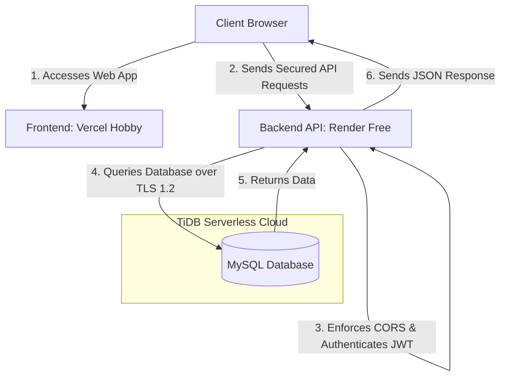

# 🚀 CodeNest Free Academy — Deployment & Hosting Documentation

This document provides a comprehensive blueprint of the production deployment of **CodeNest Free Academy**. It details the cloud infrastructure, hosting architecture, environment configuration, and a detailed step-by-step history of failures and resolutions encountered during the deployment process.

---

## 🏗️ 1. Production Architecture Overview

CodeNest Free Academy is deployed as a fully decoupled, secure, and production-ready full-stack application. It leverages a modern cloud stack:

*   **Frontend:** React 19 + Vite + TailwindCSS, hosted on **Vercel Hobby** as a static build.
*   **Backend:** Node.js + Express.js API server, hosted on **Render Free** as a web service.
*   **Database:** **TiDB Cloud (Serverless)**, providing a highly scalable, MySQL-compatible relational database with enforced SSL connections.

### Deployment Flowchart



---

## 🗄️ 2. Database Infrastructure (TiDB Cloud)

The local MySQL database was migrated to a secure, cloud-based **TiDB Serverless Cluster** on AWS (`ap-southeast-1` region) to ensure data persistence and reliable access for production.

### Database Environment
Production database credentials are stored only in hosting provider environment variables and local `.env` files that are ignored by Git.

Required backend variables:
```env
DB_HOST=<tidb-host>
DB_PORT=<tidb-port>
DB_USER=<tidb-user>
DB_PASSWORD=<tidb-password>
DB_NAME=<tidb-database>
DB_SSL=true
JWT_SECRET=<strong-secret>
OWNER_EMAIL=<owner-email>
FRONTEND_URL=<vercel-production-url>
CORS_ORIGIN=<vercel-production-url>
```

*   **SSL Requirement:** Enforced (TLS v1.2 minimum version)

### Migrations & Schema Deployment
Tables (`users`, `courses`, `modules`, `enrollments`, `progress`, `activity_logs`) were initialized and seeded with 10 free courses and modules using the automated script:
```bash
node backend/scripts/migrate.js
```
The migration script connects directly to the TiDB cluster using secure SSL connections and reads queries from `backend/sql/schema.sql` and `backend/sql/seed.sql` sequentially.

---

## 🚀 3. Application Hosting Details

The frontend and backend are deployed as separate services connected to the same GitHub repository.

### 🌐 Backend Web Service
*   **Provider:** Render Free Web Service
*   **Root Directory:** `backend`
*   **Build Command:** `npm install`
*   **Start Command:** `npm start`
*   **Runtime:** Node.js
*   **Port:** provided by `process.env.PORT`

### 💻 Frontend Static Service
*   **Provider:** Vercel Hobby
*   **Framework:** Vite
*   **Root Directory:** `frontend`
*   **Install Command:** `npm install --legacy-peer-deps`
*   **Build Command:** `npm run build`
*   **Output Directory:** `dist`
*   **Environment Variable:** `VITE_API_URL=<render-backend-url>`

---

## 🛠️ 4. Deployment Timeline & Failure Resolutions

During the migration from local development to production, several issues were encountered and successfully resolved:

### 🔴 Failure 1: LocalTunnel Instability & Disconnections
*   **Symptoms:** During initial testing, `localtunnel` was used to expose the backend server. The tunnel frequently reset, resulting in HTTP `504 Gateway Timeout` or connection refused errors.
*   **Resolution:** Decided to migrate to fully managed cloud hosting on Railway immediately rather than relying on development tunnels.

### 🔴 Failure 2: Empty/Corrupted React Files & Blank Page Crash
*   **Symptoms:** During editing, essential frontend files (`Login.jsx`, `Register.jsx`, `ProtectedRoute.jsx`, `AuthContext.jsx`) were corrupted and truncated to 0 bytes. This caused a complete React runtime compilation failure and a blank white screen.
*   **Resolution:** Identified the corrupted files, extracted the original clean page structures and AuthContext state logic from recovery logs, restored the file contents, and verified page mounting locally.

### 🔴 Failure 3: Monorepo Build and Lockfile Out-of-Sync Errors
*   **Symptoms:** Hosted builds can fail when the wrong root directory is selected or when a lockfile is out of sync with `package.json`.
*   **Resolution:** Configure provider root directories explicitly: `backend` for Render and `frontend` for Vercel.

---

## 🧪 5. Final Verification & Plan Success

The production deployment should be verified after every redeploy:
1.  **CORS Handshake:** Authenticated requests from the Vercel production URL are allowed by the backend cors middleware.
2.  **Database Security:** Database connections are strictly SSL-encrypted over TLS 1.2 on TiDB Cloud.
3.  **Owner Access:** Login with `anshbhatnagara@gmail.com` correctly auto-detects the Owner role, granting access to the private metrics and dashboard.
4.  **Student Flow:** Registering a new student profile correctly tracks XP points, module completions, and certificates.
