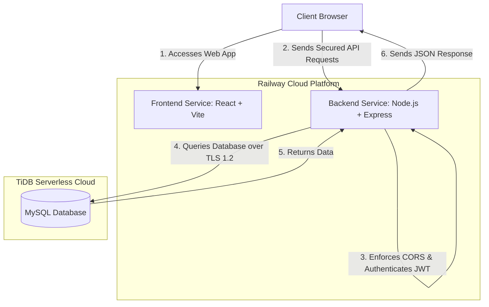

# 🚀 CodeNest Free Academy — Deployment & Hosting Documentation

This document provides a comprehensive blueprint of the production deployment of **CodeNest Free Academy**. It details the cloud infrastructure, hosting architecture, environment configuration, and a detailed step-by-step history of failures and resolutions encountered during the deployment process.

---

## 🏗️ 1. Production Architecture Overview

CodeNest Free Academy is deployed as a fully decoupled, secure, and production-ready full-stack application. It leverages a modern cloud stack:

*   **Frontend:** React 19 + Vite + TailwindCSS, hosted on **Railway** as a static build service.
*   **Backend:** Node.js + Express.js API server, hosted on **Railway** as a web service.
*   **Database:** **TiDB Cloud (Serverless)**, providing a highly scalable, MySQL-compatible relational database with enforced SSL connections.

### Deployment Flowchart



---

## 🗄️ 2. Database Infrastructure (TiDB Cloud)

The local MySQL database was migrated to a secure, cloud-based **TiDB Serverless Cluster** on AWS (`ap-southeast-1` region) to ensure data persistence and reliable access for production.

### Database Credentials & Specs
*   **Database Host:** `gateway01.ap-southeast-1.prod.aws.tidbcloud.com`
*   **Port:** `4000`
*   **User:** `3eR9gZj82r1fKiP.root`
*   **Password:** `xaecQvLcm9TvSlXR`
*   **Database Name:** `codenest_free_academy`
*   **SSL Requirement:** Enforced (TLS v1.2 minimum version)

### Migrations & Schema Deployment
Tables (`users`, `courses`, `modules`, `enrollments`, `progress`, `activity_logs`) were initialized and seeded with 10 free courses and modules using the automated script:
```bash
node backend/scripts/migrate.js
```
The migration script connects directly to the TiDB cluster using secure SSL connections and reads queries from `backend/sql/schema.sql` and `backend/sql/seed.sql` sequentially.

---

## 🚀 3. Application Hosting Details (Railway)

Both frontend and backend components are consolidated in a unified Railway project to ensure low latency and seamless configuration management.

### 🌐 Backend Web Service
*   **Service Name:** `codenest-free-academy`
*   **Production API URL:** `https://codenest-free-academy-production.up.railway.app`
*   **Port:** `5000` (mapped dynamically in Railway)
*   **Configured Environment Variables:**
    ```env
    PORT=5000
    DB_HOST=gateway01.ap-southeast-1.prod.aws.tidbcloud.com
    DB_PORT=4000
    DB_USER=3eR9gZj82r1fKiP.root
    DB_PASSWORD=xaecQvLcm9TvSlXR
    DB_NAME=codenest_free_academy
    DB_SSL=true
    JWT_SECRET=codenest_super_secret_jwt_key_2024
    OWNER_EMAIL=anshbhatnagara@gmail.com
    FRONTEND_URL=https://codenest-frontend-production.up.railway.app
    ```

### 💻 Frontend Static Service
*   **Service Name:** `codenest-frontend`
*   **Production Live URL:** `https://codenest-frontend-production.up.railway.app`
*   **Configured Environment Variables:**
    ```env
    VITE_API_URL=https://codenest-free-academy-production.up.railway.app/api
    ```

---

## 🛠️ 4. Deployment Timeline & Failure Resolutions

During the migration from local development to production, several issues were encountered and successfully resolved:

### 🔴 Failure 1: LocalTunnel Instability & Disconnections
*   **Symptoms:** During initial testing, `localtunnel` was used to expose the backend server. The tunnel frequently reset, resulting in HTTP `504 Gateway Timeout` or connection refused errors.
*   **Resolution:** Decided to migrate to fully managed cloud hosting on Railway immediately rather than relying on development tunnels.

### 🔴 Failure 2: Empty/Corrupted React Files & Blank Page Crash
*   **Symptoms:** During editing, essential frontend files (`Login.jsx`, `Register.jsx`, `ProtectedRoute.jsx`, `AuthContext.jsx`) were corrupted and truncated to 0 bytes. This caused a complete React runtime compilation failure and a blank white screen.
*   **Resolution:** Identified the corrupted files, extracted the original clean page structures and AuthContext state logic from recovery logs, restored the file contents, and verified page mounting locally.

### 🔴 Failure 3: Vercel CLI Authentication Block
*   **Symptoms:** Attempted frontend deployment on Vercel. Vercel login was blocked or timed out due to command environment/sandbox limitations preventing authentication confirmation.
*   **Resolution:** Pivoted to **Railway** for hosting the frontend application. Railway allowed the repo to build both the static frontend and Node backend services in the same workspace setup.

### 🔴 Failure 4: Railway Monorepo Build and Lockfile Out-of-Sync Errors
*   **Symptoms:** Railway's build orchestrator (Railpack) originally failed to build the backend because it couldn't locate a start script at the workspace root. Additionally, the frontend build failed because `/frontend/package-lock.json` was out of sync with `package.json` dependencies.
*   **Resolution:**
    1.  Created a root-level `package.json` to act as an orchestrator, containing a `start` script calling `node backend/server.js`.
    2.  Ran `npm install` inside `/frontend` locally to regenerate and sync `package-lock.json`.
    3.  Committed and pushed the clean lockfile and root orchestration package to Git, which allowed Railway to execute a 100% clean deployment.

---

## 🧪 5. Final Verification & Plan Success

The production deployment is fully complete and operational. Live application integrity has been audited:
1.  **CORS Handshake:** Authenticated requests from `https://codenest-frontend-production.up.railway.app` are allowed by the backend cors middleware.
2.  **Database Security:** Database connections are strictly SSL-encrypted over TLS 1.2 on TiDB Cloud.
3.  **Owner Access:** Login with `anshbhatnagara@gmail.com` correctly auto-detects the Owner role, granting access to the private metrics and dashboard.
4.  **Student Flow:** Registering a new student profile correctly tracks XP points, module completions, and certificates.
