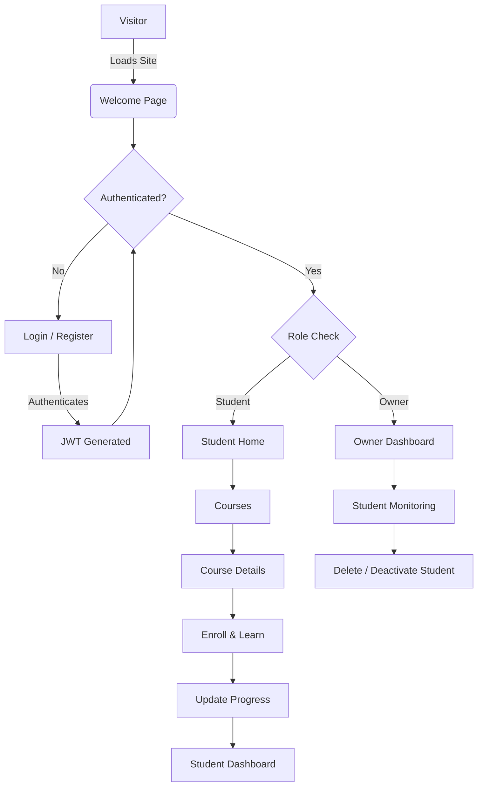
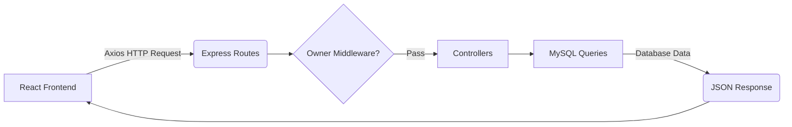
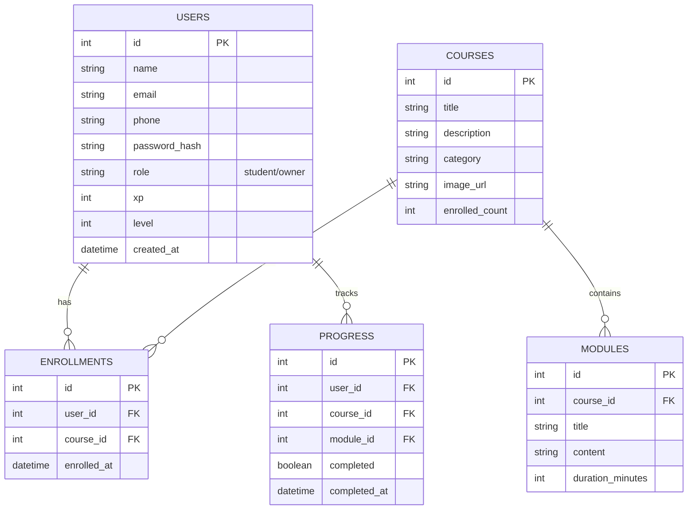

# 🎓 CodeNest Free Academy

[](#)
[](#)
[](#)
[](#)
[](#)
[](#)
[](#)

**CodeNest Free Academy** is a modern, premium learning platform designed to provide 100% free programming courses. It features a private, highly secure architecture with a unique horror-themed landing experience, comprehensive course tracking, and an exclusive owner dashboard.

---

## ✨ Features

- **Private Platform Architecture:** Unauthenticated users are met with a premium, restricted Welcome page and are required to register.
- **Dynamic Theming:** Custom horror-style aesthetic for public-facing authentication routes, contrasting with a clean, distraction-free environment for learning.
- **Secure JWT Authentication:** Token-based authentication with Bcrypt password hashing.
- **Role-Based Access Control (RBAC):** Distinct `student` and `owner` roles. The Owner Dashboard is strictly protected via environment variable matching and middleware.
- **Interactive Dashboards:** Track learning progress and module completion.
- **Responsive UI:** Fully mobile-responsive interface utilizing modern Tailwind CSS patterns (Glassmorphism, Gradients, Shadows).

---

## 🏗 Architecture Diagram



---

## ⚙️ Backend Data Flow



---

## 🗄 Database Design (ER Diagram)



---

## 📂 Folder Structure

```text
codenest/
├── backend/
│   ├── config/          # MySQL DB configuration
│   ├── controllers/     # Express route controllers
│   ├── middleware/      # JWT & Owner auth middlewares
│   ├── routes/          # Express API routes
│   ├── .env.example     # Environment variables schema
│   └── server.js        # Backend entry point
│
├── frontend/
│   ├── public/          # Static assets (Images, SVGs)
│   ├── src/
│   │   ├── components/  # Reusable React components (Navbar, Cards)
│   │   ├── context/     # AuthContext (Global state)
│   │   ├── pages/       # React Router page views
│   │   ├── App.jsx      # Main application router
│   │   └── index.css    # Tailwind & global styles
│   ├── .env.example     # Frontend variables schema
│   ├── tailwind.config.js
│   └── vite.config.js
│
└── README.md
```

---

## 🚀 Installation & Local Development

### 1. Clone the repository
```bash
git clone https://github.com/YOUR_USERNAME/codenest.git
cd codenest
```

### 2. Setup Database (MySQL)
Create a new MySQL database named `codenest`.
Run the SQL table creation queries found in the documentation to setup tables.

### 3. Configure Environment Variables
Copy the `.env.example` files to `.env` in both frontend and backend directories, then populate them.
```bash
cp backend/.env.example backend/.env
cp frontend/.env.example frontend/.env
```

### 4. Start the Backend
```bash
cd backend
npm install
npm start
```

### 5. Start the Frontend
```bash
cd frontend
npm install
npm run dev
```

---

## 📡 API Routes

| Method | Route | Description | Auth Required |
|--------|-------|-------------|---------------|
| `POST` | `/api/auth/register` | Register new user | No |
| `POST` | `/api/auth/login` | Authenticate & get JWT | No |
| `GET`  | `/api/auth/profile` | Get current user data | Yes |
| `GET`  | `/api/courses` | Fetch all courses | Yes |
| `GET`  | `/api/courses/:id` | Fetch course details | Yes |
| `POST` | `/api/progress/update` | Update module progress | Yes |
| `GET`  | `/api/owner/stats` | Fetch academy stats | Yes (Owner) |
| `GET`  | `/api/owner/students`| Fetch all registered users | Yes (Owner) |

---

## 🖼 Project Screenshots

### Public Landing (Horror Theme)
*(Screenshot coming soon)*

### Authentication
*(Screenshot coming soon)*

### Student Dashboard
*(Screenshot coming soon)*

### Course Discovery
*(Screenshot coming soon)*

### Secure Owner Dashboard
*(Screenshot coming soon)*

---

## 🌍 Deployment Guide

Detailed deployment documentation and history of failures can be found in our comprehensive [DEPLOYMENT.md](file:///c:/Coding%20Academy%20Pro%20free%20cousre/DEPLOYMENT.md) blueprint.

### Hosting Stack
- **Frontend (Vercel Hobby):** The React static application is deployed from the `frontend` root directory.
- **Backend (Render Free):** The Node.js API server is deployed from the `backend` root directory.
- **Database (TiDB Cloud):** The MySQL database runs on a secure **TiDB Serverless** cluster requiring SSL TLS 1.2 connections.

### Quick Deployment Steps
1. Connect the existing repository to Render and Vercel.
2. Set Render root directory to `backend`, build command to `npm install`, and start command to `npm start`.
3. Configure the required Render environment variables (`DB_HOST`, `DB_USER`, `DB_PASSWORD`, `DB_NAME`, `DB_SSL=true`, `JWT_SECRET`, `OWNER_EMAIL`, `FRONTEND_URL`, `CORS_ORIGIN`).
4. Set Vercel root directory to `frontend`, build command to `npm run build`, output directory to `dist`, and `VITE_API_URL` to the Render backend URL.
5. Deploy the backend first, then redeploy the frontend, then update final CORS URLs on Render.

---

## 🔮 Future Improvements

- Add robust email verification & password reset flows.
- Implement rich-text markdown rendering for course modules.
- Create automated quizzes at the end of each module.
- Add an AI Chat mentor using Gemini API.

---

## 📄 License

This project is licensed under the MIT License.

## 👨‍💻 Author

Built by **Ansh Bhatnagar**.
